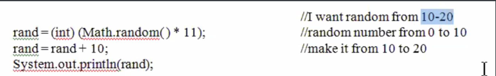
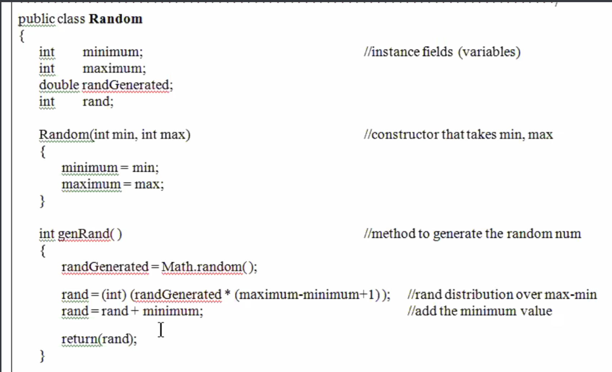
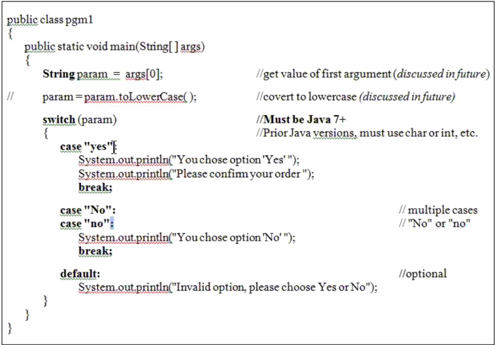
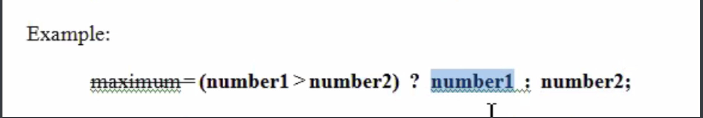

Lecture No. 7 on September 30th, 2020, 6:13pm

## Coding/Programming Style

---

## Structured Programming

- sub-dividing task into smaller and smaller tasks
  - top-down approach 
  - functions and modules (functions are within program, modules are different programs, i.e. **import something.io**

- try to minimize dependency of functions on other functions
- the job of **main** is not to do low-level actions (that's the job of modules or functions)
- benefit of structured programming - ease of maintainability 
- thought process = what do we need to do, and we start digging down

---

### Random Numbers

-  formula = take max, subtract minimum, add 1

- add minimum

  

---

## Object-Oriented Programming

- **bottom-up approach**
- need to think about the components that we need *first*, and then we assemble
- series of encapsulated objects
- OOPS I ate A PIE
- **complex objects can contain other objects**
  - i.e. think of a car; it has all these other complex objects inside of itself
  - which is smaller: an engine or a car? Using this question, that is the bottom-up approach
- a **service class**
  - a class that holds some functions to give us functionality for something, but doesn't actually do stuff by itself

- we need a **user class** to actually use these service classes

---

## Program Control

---

Sequential Processing - One process after another after another

Conditional Processing - if statements

Iterative Processing - looping over something to achieve something

---

**Indentation is important as it makes it easier to figure out what you need to pay attention to**

- Not for the compiler, but for you to read more easily!
- Not optional--make sure you indent properly

---

### Multiple if/else conditions

**Switch Statements**

A `switch` statement considers a value and compares it against several possible matching patterns. It then executes an appropriate block of code, based on the first pattern that matches successfully. A `switch` statement provides an alternative to the `if` statement for responding to multiple potential states.

ex. in **Java**

- **IMPORTANT:** *you want to break after each case so it doesn't **fall through***

  ---

  ### Conditional (ternary) operator

  - Very condensed if statement

  *condition* **?** *statement to execute if true* **:** *statement to execute if false* **;**

1. Check if number1 > number2
   - if number1 *is* greater than number2, assign number1 to maximum
     - else assign number2 to maximum

---

**Operator precedence is important**

